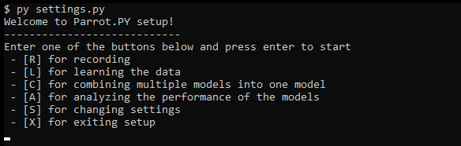

# Parrot.PY
This program is a prototype meant to explore ways to interact with computer systems and games without using a keyboard and mouse combination. It attempts to achieve this using audio and speech recognition. It also simulates mouse movements with an eye tracker ( in my case a Tobii Eyetracker ) using a seperate program called [Project IRIS](http://iris.xcessity.at/).

It's name is inspired by the way parrots and parakeets communicate, using chirps, clicks and sometimes speech. 

# Software requirements
* Windows version 7 and up.
* Project IRIS ( used for turning the eyetracker into a mouse cursor )
* Python 3.6 (64 bit if you want to use Pytorch)

Python packages such as
* numpy
* pandas 
* matplotlib *( for the graphing of test results )*
* scikit-learn *( for the machine learning bits )*
* pyaudio *( audio recording and playing )*
* python_speech_features *( for audio manipulation, specifically the MFCC algorithm )*
* pyautogui *( for mouse and keyboard simulation )*
* dragonfly2 *( For speech recognition purposes )*
* pythoncom *( for listening to speech recognition commands )*
* pytorch *( OPTIONAL - Used for improved neural nets )*

# Hardware requirements
* A decent computer to run machine learning training on
* An audio recording device, a cheap multi directional microphone will suffice
* Mouse and keyboard, for configuration purposes
* Eye tracker device ( if you want to use this program without a mouse )

# Installation

Follow the instructions in the [Installation guide for this project](docs/INSTALLATION.md)

# Configuration

This repository contains a settings.py file for recording, training and analytical purposes. 
This will allow you to tweak and improve the recognition of sounds and activation accuracy and speed of keys.

In order to map a sound to a key, you will have to go through a certain process:
* Step 1 - [Recording the sound](docs/RECORDING.md)
* Step 2 - [Training a model on the sound for recognition](docs/TRAINING.md)
* Step 3 - [Analyse whether or not the sound is properly recognized](docs/ANALYSING.md)

# Tweaking the interaction modes

As it stands right now, there is no easy way to do the configuration of the given interaction modes. You will have to edit the code yourself.
The modes can be found in the lib/modes/ directory.

Most of this tweaking will include changing the pattern detector configuration in the top of the files by changing the sounds and their percentage and intensity thresholds.

There keys should not be changed, however, inside its contents, you can tweak the following elements:
Sound - This is the name of the sound you wish to use when this key should be activated
Strategy - You can choose between.. TODO

# Running the program

You can run the program by executing `py play.py`. This process might crash if you haven't properly installed certain packages or configurated your models.

# Errors running the program

Sometimes if windows speech rec isnt started before the program, there appears to be a weird caching bug that shows the following error:
Exception while initializing sapi5 engine: module 'win32com.gen_py' has no attribute 'CLSIDToClassMap'
You can fix that by starting windows speech rec, going to your C:\Users\YOURUSER\AppData\Local\Temp directory and rename gen_py to gen_py2 or something. This will rebuild the cache for gen_py the next time the program is run.

### Todos

 - Add examples of how to use the program
 - Seperate out the eyetracker and speech recognition parts, in order to allow the users not to have to install and configure all the different parts in order to get set up properly. 