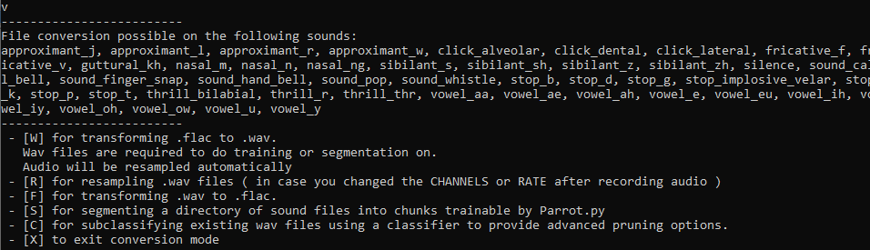

# Converting audio
---

If you have existing audio recordings that you want to convert, such as flac files or wav files with a different sampling rate, you can convert them inside parrot.
Most of this uses FFMPEG under the hood, so check the installation guide for that optional installation step.
You start converting files by following the [V] menu in the `py settings.py` command.

Converting audio file extensions and data ( FFMPEG needed )
---

There are two extensions that parrot supports for conversion, flac and wav. 

Flac is the standard file output from audio recording in Talon Voice, a similar program that leverages powerful speech recognition and noise recognition much like parrot. [!The website of this program can be found here](https://talonvoice.com/)
As of the moment of this writing, Talon uses a sample rate of 16kHz with 1 audio channel.
Users that seek to use their existing talon noise recordings to try out parrot can use the following workflow.

1. Copy the contents of the recordings over to your recording folder ( path is in the config/config.py RECORDINGS_FOLDER setting )
   Make sure the contents are two levels deep - the folder name should be the name of the recorded sound, and the files inside should be the .flac files.
2. Configure the config/config.py file with RATE=16000 and CHANNELS=1
3. In the conversion menu, press [W]
4. Select all the sounds you desire to convert
5. Let it do the conversion. The files will be placed inside the folder designated by the CONVERSION_OUTPUT_FOLDER setting in the config/config.py file.

Please note that parrot does not aim to be a replacement of Talon Voice. In fact, for most cases I would recommend Talon Voice over parrot. 
Do consider donating the audio files you might have already recorded to Talon, as it greatly helps develop this program. 
Your recordings will help recognition of noises for a lot of different users using that program in the future. 

Converting from wav to flac is also possible, in case you desire to export noise reco1rdings from parrot to donate and to use in Talon Voice. 
The process is mostly the same, except you can just press [F] in the conversion menu. The output flac files will maintain their original recorded channels and sample rate, they will not be converted to the sample rate and channels given in the config/config.py settings.

In case you have tweaked the channels and rate in the config file, and do not want to record all the noises again, a resampling option is available under [R] as well.
If you change the rate, unfortunately you will also need to retrain the model. I have done experiments with a higher sample rate model using lower sample rate audio, and the results weren't usable.

Segmenting or augmenting audio into recognizable files
---

Parrot ultimately relies on wav files of a fixed length to do its learning. As such, all the wav files need to be segmented properly.

For this purpose there is a segmentation option in the conversion menu, which can be activated by [S]. This segmentation menu will allow you to selected the sounds to segment and its filtering thresholds.
For a more indepth view of that process, take a look at the recording documentation: [Recording sounds](RECORDING.md). I recommend playing around with the thresholds to see what works, you want a clean as possible divide between your sound and silence.

The segmented files will be placed in the output folder in the same folder structure as your recording folder, but containing the segmented files.
You can then either move the contents over to the DATASET_FOLDER designated in the config/config.py file, or you can change that config setting around to point to the output folder of the segmentations.

You can also augment your recordings with more samples without having to record new ones. This will give your models a lot more data to work with, however, real recorded data is almost always better than synthetic data created using augmentation.
The augmentation process takes the existing .wav files and adds various amounts of noise, timeshifting and stretching to produce new audio files.

( TODO )

Subclassifying existing wav files
---

In advanced use cases, you might want to combine noises rapidly after one another. Because there is still an echo of the previous sound, this will inhibit the recognition of the following sound until that one becomes clear enough for the classifier.
For example, if we want to recognize 'oh' and 'n' rapidly after one another, we might want to record 'on' and seperate out the files using this method to improve recognition in those cases.
This is where the subclassifying comes in. It allows you to seperate recording files using an existing classifier.
The output will be a folder structure of the classified labels for each file. You can then decide which label should be put in the 'oh' folder, and which should be placed in the 'n' folder. 

( TODO )