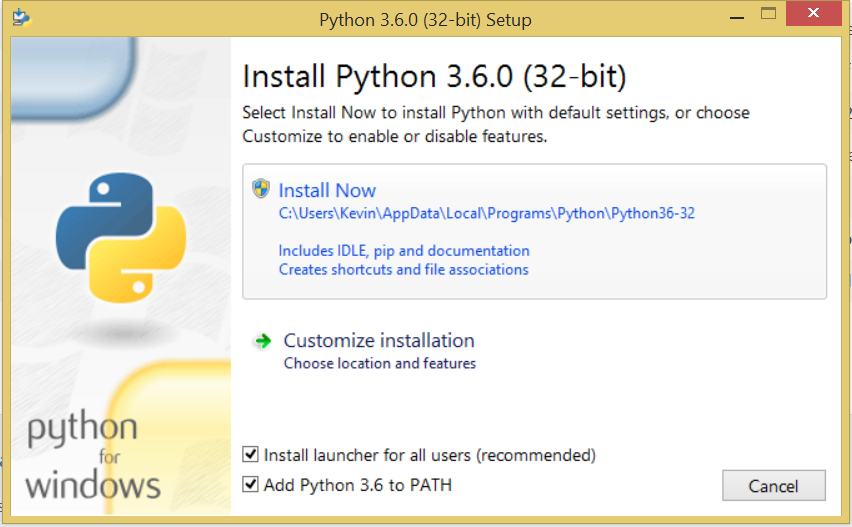
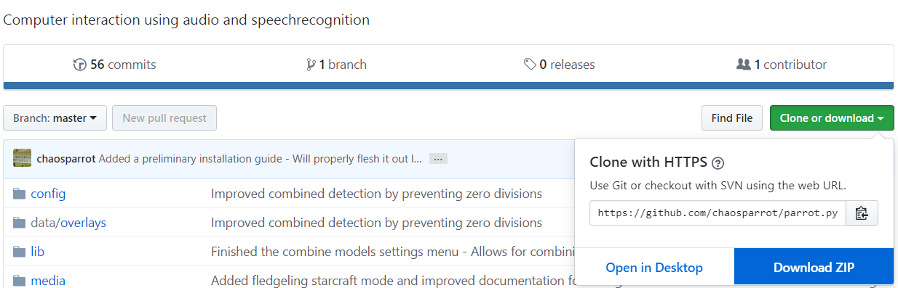
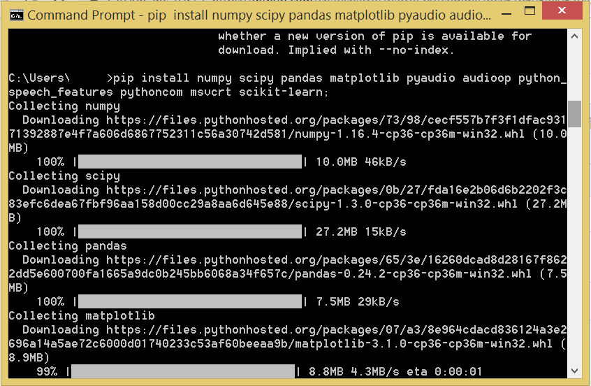

# Installation guide
-----------

This guide focuses on Windows installation.  See also [Mac installation](./MAC_INSTALLATION.md) and [Linux installation](./LINUX_INSTALLATION.md) for some platform-specific help

For this program to work, you must atleast have access to a microphone and a machine that can run Python 3.8 64 bit.
This document describes installing the program on a Windows machine.

If you want to install on a Mac, steps 1 to 3 can be found here: [Mac installation guide](MAC_INSTALLATION.md).
If you want to install on a Linux device, steps 1 to 3 can be found here: [Linux installation guide](LINUX_INSTALLATION.md).

Do note that this guide only details how to set up the base installation of this program ( i.e. being able to run the program without random crashes ). 
There are no ready-made audio recognition models added to this installation, you will have to make those yourself using the settings menu.
You will also have to change the modes to your own needs.

Step one - Installing python
----------



This can be done by following the [Python installation link](https://www.python.org/downloads/release/python-380/) and selecting your desired way of installing - I used the Windows x86 executable installer option.
Make sure you have the checkbox 'Add Python 3.8 to PATH' enabled and pick the Install Now option. 

Step two - Download and extract the zipfile from this github repository
---------------



Now download the zip of this github repository and save it somewhere on your computer. It doesn't need to be in program files or anything, it can just be on your Desktop.
Extract the files in another folder and you can start testing the settings menu.
Now, make sure to go to your Parrot.py location, in my case that is the desktop. So I would type `cd "C:\\Users\\anonymous\\Desktop\\parrot.py-master"` 
Make sure that you can see the requirements.txt file if you run the `dir` command, that means you're in the right place!

Step three - Installing all the packages
---------



Now that you have python installed, you can use it to download packages. Open a command line program ( Search for cmd in your Windows search box ) and test if your python is installed properly.
This can be done by typing 'python --version', this will display the version of your current python installation. If it is 3.8, you should be good to run the following code.

For PyAudio to work, you have to download a .whl corresponding to your python version installation.
You can find the .whl files here: https://www.lfd.uci.edu/~gohlke/pythonlibs/#pyaudio
It's easiest to place the whl file inside of the parrot folder, as you already have the command line program opened there.
As I use python 3.8, my install instructions look like this:

```bash
pip3 install PyAudio-0.2.11-cp38-cp38-win_amd64.whl
pip3 install pyaudio
```

After this, you can install the remaining requirements using the following command.

```bash
pip3 install -r requirements-windows.txt
```

Now you can run the following command to see if everything works

```bash
python settings.py
```

If any errors occur, try opening the text file and installing each line seperately and run again.

Optional - Step four - Training Windows Speech recognition
---------------

Before you can make use of the speech recognition part, you will have to train Windows Speech recognition on your microphone and your voice.
You can do this by opening up windows speech recognition and following their installation instructions. 
You can also use Dragon Speech Naturally if you want more proper dictation possibilities, but for short commands, windows speech recognition functions just fine.

With all these steps followed, you can run the `py play.py` command on your command line tool to run the program. But first, you will have to tweak your settings to match your needs. 

Optional - Download NIRCMD.exe and place it inside the root folder
----------------

This executable allows the program to more easily toggle the system volume. If you don't need this functionality, it isn't required.

Optional - Install the eyetracker software
---------------

To be able to move your mouse cursor without using your hands, you must have access to an eyetracker and a way to map the cursor roughly to the place where you are looking.
For this, I use the Tobii Eye Tracker 4C and a seperate program called Project IRIS. The latter can be trialed for about a month before you have to purchase it.
I haven't tried any other eye tracker, but this one seems just fine for this program.

Follow their installation instructions and make sure you can toggle your mouse cursor following by pressing a key - I have F4 configured to toggle it

Optional - Install PyTorch CUDA for advanced neural network usage
----------------

I personally saw a big improvement when I switched to neural networks running in an ensemble. 
Pytorch offers a vast array of machinelearning techniques that might be useful to get even more recognition strength out of your generated models. 
By default, it is installed with the regular installation of Parrot, but you might have to install the stuff that uses your graphics card later if you want to train large models quicker.

When you want to start training larger models with your graphics card, you can download the pytorch version here: https://pytorch.org/get-started/locally/ 
Make sure you select Python and pip for installation, and the CUDA version you have installed. If you do not have a graphics card with CUDA, you can also select the None option there, but training will be a lot slower.

Optional - Install FFMPEG for recording file conversion
----------------

It is handy to be able to convert already recorded audio files in case you want to tweak the channels or rate after having recorded the audio files.
For this reason, FFMPEG is required if you desire to convert existing files.
If you already have it installed, simply point to the place where it is installed inside the data/code/config.py file using this line
```PATH_TO_FFMPEG = "your_ffmpeg_location_here"```

Installing ffmpeg on windows is as easy as downloading it and unzipping it somewhere on your computer. The executable should be inside the bin folder in there.
By default, the program assumes the ffmpeg executable is placed in ffmpeg/bin inside parrot.
Therefore, it is recommended to move the whole ffmpeg folder over to the parrot root directory and rename the ffmpeg root directory name to ffmpeg. 
That way it should work out of the box without having to go into configuration.
