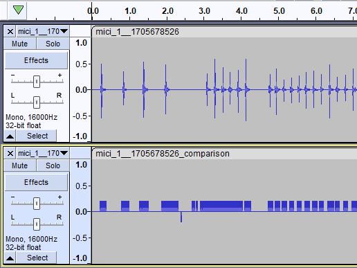
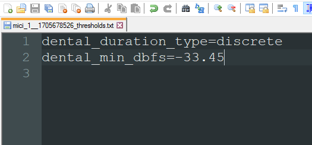
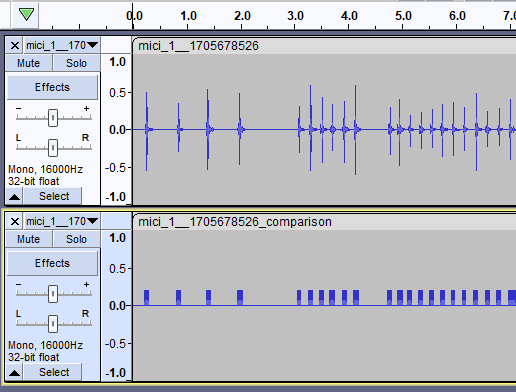

# Recording sound files
----

In order to train a model, you need to record sounds first. You can do this by running `py settings.py` and pressing the [R] key, this will lead you through the steps neccesary for recording.

This script will record your microphone and save the detected areas inside of an SRT file. It will record in overlapping segments of 30 milliseconds.
You have to be sure to record as little noise as possible. For example, if you are recording a bell sound, it is imperative that you only record that sound.

During the recording, you can also pause the recording using SPACE or quit it using ESC.
If you feel a sneeze coming up, or a car passes by, you can press these keys to make sure you don't have to remove data.
If you accidentally did record a different sound, you can always press BACKSPACE or - to remove some data from the recording.

You can look at the 'Recorded' part during the recording session to see how much of your sound has been detected.

### Amount of data needed

The Data quantity part of the recording shows you whether we think you have enough data for a model.
The minimum required is about 16 seconds, 41 seconds is a good amount, and anything above 1 minute 22 seconds is considered excellent.
You will start getting diminishing returns after that, but the returns are still there. I used about 4 minutes per sound for the Hollow Knight demo.
You can try any amount and see if they recognize well.

If you want the model to do well, you should aim to have about the same amount of recordings for every sound you record.

### Checking the quality of the detection ( Optional )

If you want to see if the detection was alright, you can either open up the SRT file inside the segments folder of your recorded sound and compare it to the source file, or use the comparison.wav file inside of the segments folder. I personally use the latter, because it is more visual and I can listen to when the detection was made.

If you place both the source file and the comparison.wav file inside a program like Audacity, you can see the spots where it detected a sound. When the buzzer is sounding, a detection was made, and when it is moving down, it is a detection that is filtered out by the matching algorithm.

### Manual tweaking ( Optional )

If you do not like the results from the automatic recording process, you can tweak the results afterwards. We will go through an example where we dislike the detection of a sound called 'dental_click'.

Inside the /dental_click/segments folder, you will find three files. [RECORDING]_comparison.wav, [RECORDING].vX.srt and [RECORDING]_thresholds.txt, also known as the comparison, SRT and threshold files respectively. The thresholds file contains the automatically detected thresholds which were used to generate the comparison and SRT file.

In order to tweak the results, we need to change the thresholds file. Open it up in a text editor, and tweak the min_dbfs value. ( dBFS ranges from -96 to 0, where 0 is the highest value, [a full explanation on dBFS](https://en.wikipedia.org/wiki/DBFS) is available on Wikipedia ).
If we increase the dBFS value closer to 0, we will get a more strict detection and find less data. If we decrease the value, we will get more detections. Ideally, we want as little false detections as possible, as that deteriorates the model, but you are free to choose a value that matches your desired results. Save the thresholds file when you're done.

Now run `py settings.py` in the command line. This will detect that you have changed the thresholds file and rerun the detection, and it will now make a MANUAL.srt file. This file will be used for collecting training data over all auto-generated srt files. It will also update the comparison file. After it is done processing, open Audacity and compare the two files. You should now see a difference and can compare if it is more to your liking.

If something crashes during the regeneration of the files, and you're unsure what the error is saying, just remove the /segments folder within the sound. That will always automatically regenerate the segmentation files, and you can try and tweak them again.

You can also change the duration_type if you wish. 'continuous' and 'discrete' are the options, and both have specific strategies relating to filtering noise and detecting the true sound. If you're unsure, don't change this value.

### Background noise

It helps to record some background noise as well, like talking or a fan on your desk if you use that a lot. If you have a recording of those sounds, the models will learn to ignore the sound coming from those by not accidentally triggering actual noises. Silence is also recorded, but they are caught by retrieving all the silence in between the recordings rather than you having to record it yourself.

[Step 2 - Training the model](TRAINING.md)