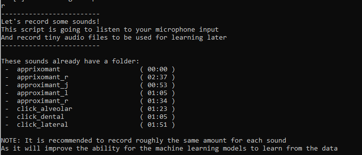
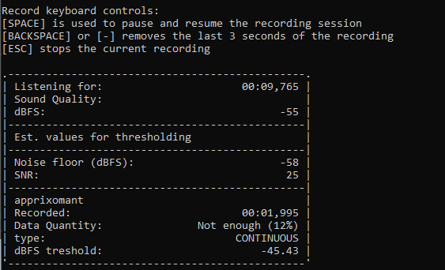
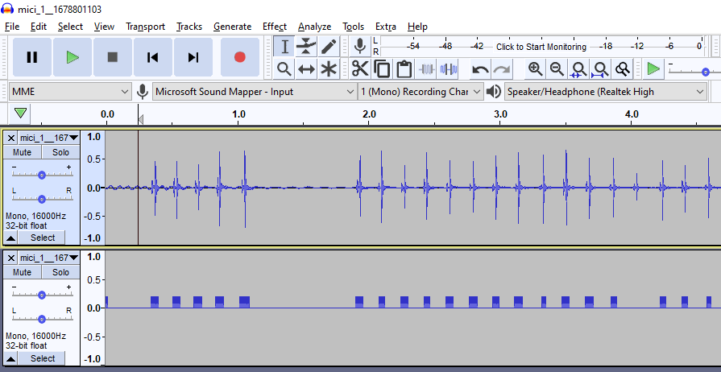

# Recording sound files
----

In order to train a model, you need to record sounds first. You can do this by running `py settings.py` and pressing the [R] key, this will lead you through the steps neccesary for recording.

This script will record your microphone and save the detected areas inside of an SRT file. It will record in overlapping segments of 30 milliseconds.
You have to be sure to record as little noise as possible. For example, if you are recording a bell sound, it is imperative that you only record that sound.

During the recording, you can also pause the recording using SPACE or quit it using ESC.
If you feel a sneeze coming up, or a car passes by, you can press these keys to make sure you don't have to remove data.
If you accidentally did record a different sound, you can always press BACKSPACE or - to remove some data from the recording.

You can look at the 'Recorded' part during the recording session to see how much of your sound has been detected.

### Amount of data needed

The Data quantity part of the recording shows you whether we think you have enough data for a model.
The minimum required is about 16 seconds, 41 seconds is a good amount, and anything above 1 minute 22 seconds is considered excellent.
You will start getting diminishing returns after that, but the returns are still there. I used about 4 minutes per sound for the Hollow Knight demo.
You can try any amount and see if they recognize well.

If you want the model to do well, you should aim to have about the same amount of recordings for every sound you record.

### Checking the quality of the detection

If you want to see if the detection was alright, you can either open up the SRT file inside the segments folder of your recorded sound and compare it to the source file, or use the comparison.wav file inside of the segments folder.
If you place both the source file and the comparison.wav file inside a program like Audacity, you can see the spots where it detected a sound.

### Background noise

It helps to record some background noise as well, like talking, silence or a fan on your desk if you use that a lot. If you have a recording of those sounds, the models will learn to ignore the sound coming from those by not accidentally triggering actual noises.

[Step 2 - Training the model](TRAINING.md)