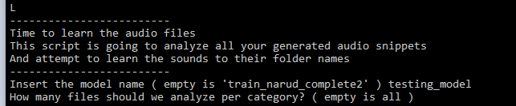

# Training a model
----

The goal of this step is to train a model that is accurate enough to prevent misclicks from happening and from other key strokes not being registered. 
Training a model involves going through the [L] menu when running `py settings.py`. 
This script will learn from your recorded audio samples and train a machine learning model to recognize them, finally saving the model in the models folder ( default is data/models, this can be changed in config/config.py ).
Here you will choose the model name and which sounds you want to recognize.

The algorithm model used is able to recognize sounds well, but it might get confused and think that different sounds are being played.
For example, imagine clapping your hands and snapping your fingers. These sounds are fairly similar, and the algorithm will have a hard time differentiating between the two.
It is therefore recommended that you learn sounds that are fairly different from one another, so that the amount of misclicks is minimized.

One simple rule is that it seems to be able to tell high pitched sounds apart better than low frequency sounds. 
Things like metal chimes, bells, hissing sounds like long drawn out 'S'es or 'F's are recognized really well.

The algorithm also seems to become less accurate as more and more different sounds are added to it. 

When you have gone through the generation of the model, you can check for its results. It will give an estimate of how good it thinks it is ( seen in the green accuracy box ).
While the percentage alone does not give you enough information about how well the model will perform on certain sounds, it gives a good estimation of whether or not the model is useful at all.
I like to keep this estimate above 90%.

On top of that, you can also generate a detailed analysis. This will create a confusion matrix ( seen on the right ).
The Y axis is the actual sound name that you recorded, the X axis is the sound name the generated model thought it was hearing.
In the example image above, you can see that in 4 cases, it thought wrongly that a clucking sound was actually a finger snap.
The goal of this graph is to have a really visible diagonal line from top left to the bottom right. This means that the generated model doesn't confuse the sounds between one another much.

[Step 3 - Analysing the results](ANALYSING.md)