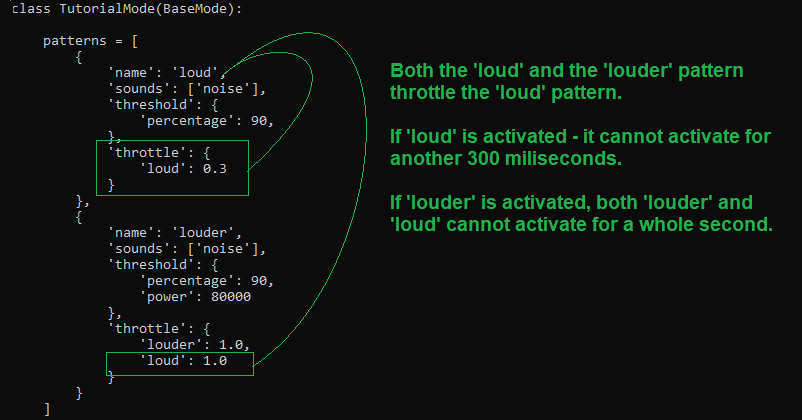
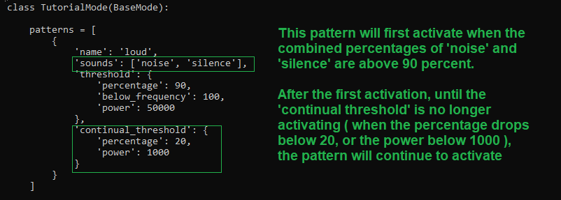
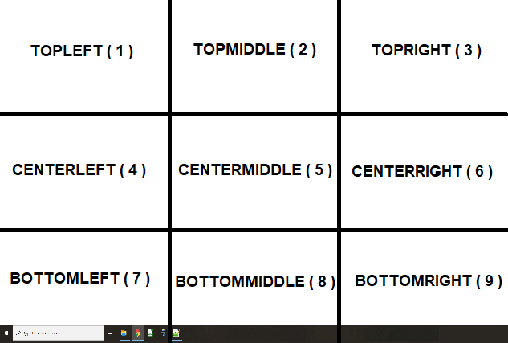
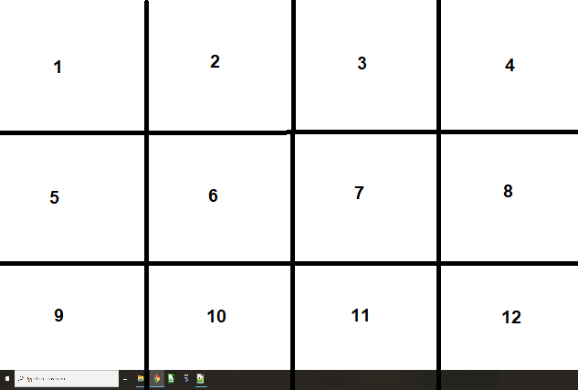

# Making your own interaction mode
----

The goal of this step is to make your own interaction model that does keyboard and mouse interactions when responding to your sounds and speech.
This step will require programming, but I've made this tutorial with the assumption of no prior knowledge. So it should at least be followable for a novice.
You will need to have a trained model before we can interact with it however, so make sure you have followed the previous steps. Or simply use the dummy classifier ( which only classifies noise and silence )

In the examples directory, there are files labeled mode_tutorial_a.py - These are complete files with comments and explanations about what they do.
You're free to copy and paste them in the lib/modes/ directory, and if you're running into issues, you can always copy back the original in the examples directory over the altered one in the lib/modes directory.

Running an interaction mode for testing ( uses mode_tutorial_a.py )
----

First, copy over the mode_tutorial_a.py file from the examples directory over to the lib/modes directory. This is an empty interaction mode that won't react to anything.
If you need a clean configuration, you can also copy over the config file in the examples directory to the config directory.

We can run our program using the `play.py` command.
This will automatically run the default classifier and the default mode in the config/config.py command. 
You can always change this to match your own trained model and classifier.
Remember, you can always pause or quit the program by pressing SPACE or ESC respectively.
If you encounter a crash during this command, make sure you have followed the installation process and make sure you haven't skipped any steps.

For now, we will run the `py play.py` command with a few bits added to them. 
Adding ` -t` will run the program in testing mode. In this mode - No key presses or mouse clicks will be performed, but they will be printed in your terminal.
Adding ` -m mode_tutorial_a` will run the program with the mode_tutorial_a file placed in the lib/modes directory. Currently, because mode_tutorial_a is empty, it won't do much but listen for sounds.
Adding ` -c dummy` will run the program using the dummy classifier which only recognizes sound and noise. Of course, you can replace dummy with your own trained model to use that model.
If any of these additional bits are omitted, the program will revert to the defaults set in the config/config file.

As you can see, nothing is actually being done now when you are running the program. We're going to change that in the next step.

Keyboard and mouse interaction ( uses mode_tutorial_b.py )
----

Inside the mode_tutorial_b.py file, there are a number of lines between four # signs that denote the different kind of basic interactions that you are able to do.
For the keyboard, you can press and hold down keys. And for the mouse you can drag, left and right click. 

Copy the mode_tutorial_b file over and remove one of the # signs in front of a line to test it out. You can run the testing command to safely see if it is registering a command.
`Press` instantly presses a key whenever a sound is detected, but this will cause a lot of repeat keystrokes rapidly after one another.
`Hold` holds a key down and sends press events, trying to simulate your keyboard. That means whenever hold is run, it will press one key first, and only after half a second, will repeat the key after half a second. 
Just like your regular keyboard! This is generally a safer option to take. 
`Leftclick` presses your left mouse button, while `rightclick` presses the right one.
`Drag_mouse` holds down your left mouse button, enabling dragging over things like text or units.

You will notice that once you turn silent, things like mouse dragging and holding down keys will automatically stop. This is something that is done for you in the lib/modes/base_mode file.
The only keys that are kept pressed down are CTRL, SHIFT or ALT if they were run with hold. You can release those special keys using the `release` function.

More interactions, such as scrolling and holding down the middle mouse button, are possible using the pyautogui library that you installed when setting up Parrot.py. 
[View the pyautogui documentation and possible keyboard keys here](https://pyautogui.readthedocs.io/en/latest/keyboard.html)
You can also look in the lib/input_manager file for examples on how pyautogui is used.

If the keycodes aren't being registered in the program you are trying to control, they might be using DirectX keycode captures.
To switch to DirectX keycodes, add use_direct_keys = True just below the classname. That might resolve the problem

Detection strategies ( uses mode_tutorial_c.py and mode_tutorial_d.py )
----

Now we are going to connect our sounds to our keyboard inputs. This can be done using patterns.
Patterns are a combination of activation thresholds and throttles. Every individual pattern must have a name to identify it, sounds which you can detect using your model, and some activation thresholds like power, intensity and frequency.
Optionally you can add things like throttles to your activation to make sure your pattern doesn't get activated continuously.

If you need more thorough explanation of what patterns can do, go to this link: [Patterns](PATTERNS.md)

In our example file ( mode_tutorial_c.py ) we have two patterns that can be detected. Loud is connected to the noise sound ( which is a sound that is detected by the dummy model ) and will only get activated if the model is above 90 percent certain that the sound is being heard.
Another pattern is called louder, and this one has a second threshold 'power' of 80.000, and will only get activated if the power of the sound is above 80.000 despite it listening to the same sound.
There are many complex things you can do with patterns. The example below shows how you can throttle multiple sounds after activation.

The example below shows a pattern where the percentages of sounds are combined to reach a threshold. There is also a secondary threshold that is useful for continuous sound activation which changes its intensity over a long while.

Back to mode_tutorial_c.py.
You can see the if detect statements ( On line 29 for example ). In case the pattern louder is being detected, we will press B, if the loud pattern is detected, we will press A.
This is the thing that connects our detection patterns to actions. There are many different things you can do with if statements ( as seen in the documentation over at: https://docs.python.org/3/tutorial/controlflow.html ).
But one thing you must make sure of, is that you use the right amount of spaces on the next line ( On line 30 in our example ) to make sure the program doesn't crash.

This step is more trial and error. I personally use the testing mode to see what thresholds work best for what activation function.

Detecting areas on the screen ( uses mode_tutorial_e.py and mode_tutorial_f.py )
----

Now that we can connect our sounds to actions, there are other things to explore. One of them is connecting a certain action to an area on the screen.
Many times, your model might not be able to recognize a lot of different sounds. Practically, it can be handier to have a few sounds that are recognized well, but are seperated from actions in another way.

There are two easy ways to check whether or not your mouse ( or eyetracker cursor if you are using an eyetracker that moves your mouse ) is in a specific region of the screen.
There is the value quadrant3x3 - Which displays in what quadrant the mouse is in ( regions shown below )

And there is the value quadrant4x3 - Which uses the following quadrants:

In our mode_tutorial_e.py example, you can see that when we detect the noise sound and combine it with a specific area of the screen, we can increase the amount of actions for a single sound by 9 if we use the 3x3 quadrant.
When we use the 4x3 quadrant, that number increases to 12! This allows us to use far less sounds, or use a specific sound that is recognized quickly and accurately, to press a multitude of different buttons.

It is also possible to detect whether or not your mouse is in a custom area of the screen.
In the mode_tutorial_f.py example, you can see the detect_inside_screen function. Here you can give your topleft coordinates ( x an y ) and the width and height of the box you want to detect.
In this case, we use the topleft coordinate of the screen ( 0, 0 ) and detect a box 400 pixels wide and 400 pixels down.

Using speech recognition ( uses mode_tutorial_g.py )
----

There is another way to connect sounds with actions, and that is through speech recognition. This uses the dragonfly and windows speech recognition api that you might have installed and configured.
Speech recognition is very powerful, and allows you to map your voice commands to actions with relative accuracy without having to do manual sound training in Parrot.py. 

Before you try out speech recognition, make sure to change the SPEECH_RECOGNITION_ENABLED to True in the config/config.py file.
In the mode_tutorial_g.py file, I have added two speech commands. They can be read in the part annotated with A. These two commands will press a and b respectively, but the last command will also toggle speech recognition off.

On top of that, you will notice a handle_sound and a handle_speech area. Parrot.py allows you to recognize the speech recognition in unison with regular sounds, however, these can usually conflict with one another. 
Let's say that you bind the 'ah' sound to a key, while you use that sound in one of your speech commands. On top of that, windows speech recognition tends to have a bunch of commands readily available to execute, which you might not want to activate accidentally.
( For example, shut down your computer or shut down the game you're playing ).

This is the reason for toggle_speech. This will toggle between handle_sound being used, and handle_speech. In the handle_speech area, I have added a detection for a chime sound.
I have made two sounds detectable. The regular loud noise and a chiming sound ( You can hiss loudly to activate it ). This allows you to rapidly switch between speech and sound mode.

For advanced usecases, you can check the documentation over at https://pythonhosted.org/dragonfly/ . Internally, you can see how the BaseMode uses the grammars to build up a simple speech to action workflow.

Conclusion
----

This concludes the basic tutorials for making your own interaction modes. I hope you have all the examples you need. If you are missing something, or aren't sure about some functionality, please do let me know.

